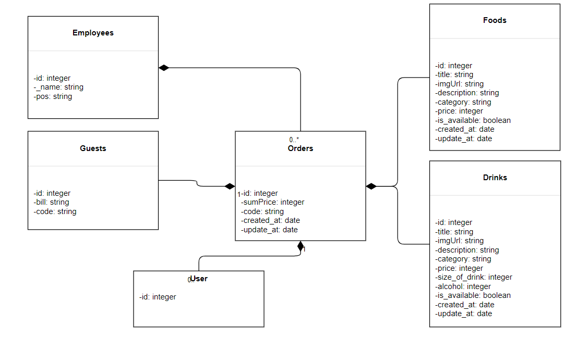
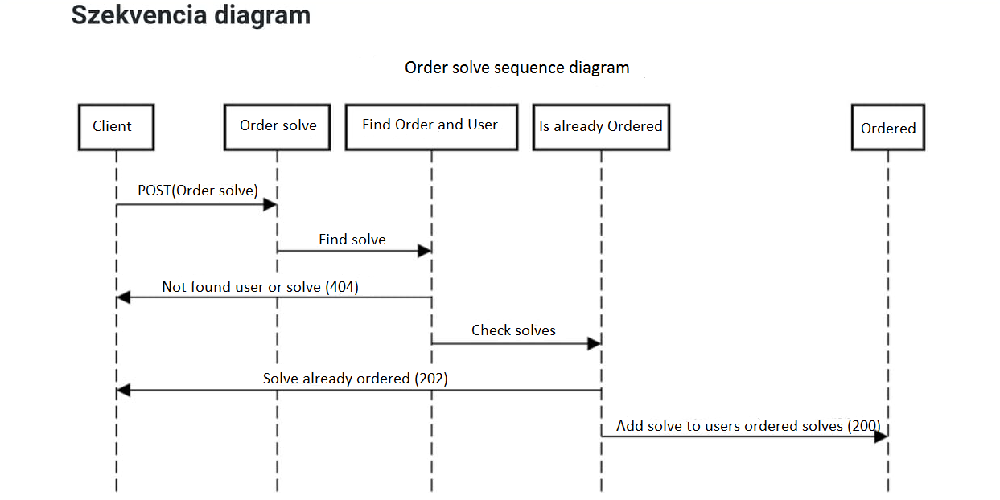
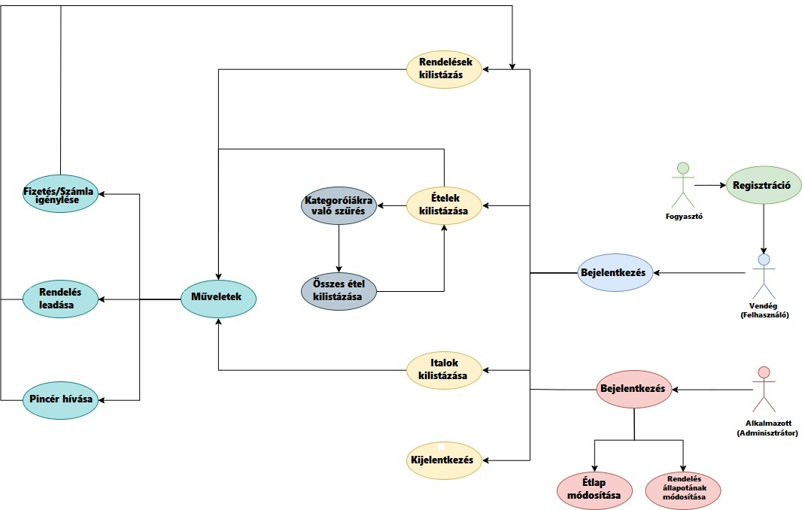

# Alkalmazások fejlesztése beadandó feladat
*Készült Magyar Ádám és Solti Péter keze által*
### Éttermi rendelő felület

**Egy rendelést lebonyolító applikáció, amelyben egyszerre többféle rendelést lehet kezelni**

Beadandó feladat az ELTE Informatikai Karon, az Alkalmazások fejlesztése nevű tárgyból.

## Dokumentáció:
### Funkcionális elvárások

**Funkcionális követelmények:**

-   Alkalmazott, vendég regisztráció
-   Alkalmazott, vendég bejelentkezés
-   Ételt és ital kategóriák listázása
-   Ételek listázása
-   Italok listázása
-   Ételek és italok keresése
-   Vendég rendelhet ételt és italt
-   Vendég jelezheti, ha egyéb kérése van (esetleg takarítást, új evőeszközt
    kér)
-   Vendég kérheti a számlát
-   Vendég lekérdezheti a számla jelenlegi részösszegét
-   Vendég adhat megjegyzést az adott rendeléshez
-   Vendég módosíthatja a rendelését (a rendelés feldolgozása előtt!)
-   Vendég adhat meg kupon vagy törzsvendég kódot
-   Alkalmazott hozzáadhat ételt és italt az étlaphoz/itallaphoz
-   Alkalmazott módosíthatja a rendelés állapotát
-   Alkalmazott módosíthatja az elérhető ételek, italok kínálatát
-   Alkalmazott módosíthatja az árakat (ha nincs vendég az étteremben)
-   Alkalmazott kijelentkezés

**Nem funkcionális követelmények:**

-   1-sok kapcsolat használata
-   sok-sok kapcsolat használata
-   Java Spring Boot technológia használata
-   MVC modell
-   REST API
-   authorizált végpontok használata

**Szakterületi fogalomjegyzék:**

-   Étel és ital kategóriák: Egy szűkítő lista, mely segít a keresett étel
    gyorsabb megtalálásában (pl.: saláta, leves, üdítő)
-   Étel: Az elérhető ennivalók, hozzávalókkal és allergénekkel feltüntetve
-   Ital: Az elérhető innivalók, űrmértékkel és alkoholszázalékkal feltüntetve
-   Ár: Egy adag étel, ital költsége Forintban
-   Számla: A vendég fogyasztásának végösszegét tartalmazó dokumentum
-   Asztalkód: Minden asztalnak van egy rendelő felülete egy egyedi
    azonosítóval, így a vendégek kényelmesen, bejelentkezés nélkül tudják
    igénybe venni az étterem szolgáltatásait
-   Alkalmazott: Az étterem működtetéséhez szükséges jogosultságokkal rendelkező
    user
-   Vendég: Az étterem szolgáltatásait igénybe venni képes jogosultságokkal
    rendelkező user

**Szerepkör:**

-   Alkalmazott: Jogában áll az étel és itallap tartalmát és árát módosítani, a
    rendelés állapotát frissíteni
-   Vendég: Ételeket, italokat tud keresni, rendelni, melyhez tud megjegyzést
    fűzni vagy azt módosítani. Kérheti a számlát és jelezheti ha egyéb igénye
    volna.
	
### Fejlesztői környezet, használt technológiák

- IntelIJ lokális IDEA
- Spring Boot framework
- GithubDesktop verziókezelő alkalmazás
- NodeJS javascript környezet
- Visual Studio Code kódszerkesztő
- Bootstrap framework 
- Angular framework

### Fejlesztői környezet felállítása

- Git verziókezelő telepítése
  /Githubon történő regisztráció ajánlott/
- Node.js környezet telepítése
- Projekt klónozása lokális gépre
- A projektkönyvtárban a függőségek telepítése: npm i
- Kívánt adatbázisdriver telepítése, ha még nincs, pl: npm i sqlite3
- App indítása: npm start

### Adatbázis terv

### Szekvencia diagram

### Használati eset diagram

### Könyvtár stuktúra

- Images:
    - images
- Controllers:
    - DrinksController.java
    - EmployeesController.java
    - FoodsController.java
	- GuestsController.java
	- OrdersController.java
    - UserController.java
- Entities:
    - Drinks.java
    - Employees.java
    - Foods.java
	- Quests.java
	- Orders.java
    - User.java
- Repositories:
    - DrinksRepository.java
    - EmployeesRepository.java
    - FoodsRepository.java
	- QuestsRepository.java
	- OrdersRepository.java
    - UserRepository.java
- Security:
    - AuthenticatedUser.java
    - CustomBasicAuthenticationEntryPoint.java
    - MyUserDetailsService.java
    - WebSecurityConfig.java
- Resources:
    - application.properties
    - import.sql

- app:
    - drink-form
	- drinks
	- food-detail
	- food-form
	- food-lista
	- login-form
	- order-component
	- registration
	- routing
	- status-filter
	- app.component.css
	- app.component.html
	- app.component.spec.ts
	- app.component.ts.
	- app.module.ts
	- auth.guard.spec.ts
	- auth.guard.ts
	- auth.service.spec.ts
	- auth.service.ts
	- drink.service.spec.ts
	- drink.service.ts
	- drink.ts
	- food.service.spec.ts
	- food.service.ts
	- food.spec.ts
	- food.ts
	- issue.service.spec.ts
	- issue.service.ts
	- issue.spec.ts
	- issue.ts
	- order.service.spec.ts
	- order.service.ts
	- order.spec.ts
	- order.ts
	- registration.service.spec.ts
	- registration.service.ts
	- user.spec.ts
	- user.ts

### Kliensoldali szolgáltatások listája ###

- **Regisztráció:** Minden látogató számára elérhető. Felhasználónév és jelszó megadása szükséges. Abban az esetben, ha valamelyik mezőt nem jól töltjük ki, a bejelentkezés meghíúsul.

- **Bejelentkezés:** A regisztrált felhasználók számára elérhető. Felhasználónév és jelszó megadása szükséges. Bejelentkezés után használhatjuk az alakalmazást.

- **Szűrés:**  Az étlapon lévő ételeket, italokat szűrhetjük. Szűrhetünk levesre, főételre, húsokra stb. Az összes étel, ital kilistázására is van lehetőség.

- **Hozzáadás és módosítás:** Hozzáadhatunk vagy módosíthatunk ételeket, italokat az étlapon.

- **Törlés:** Az elérhető ételeket és italokat törölhetjük a rendszerből, feltéve ha Alkalmazottként vagyunk bejelentkezve.

- **Kijelentkezés:** Kijelentkezünk az alakalmazásból

### Kapcsolat a szerverrel ###

- Az alkalmazás a szerverre végpontok segítéségével csatlakozik. Adott esemény hatására a hozzá tartozó, neki megfelelő végpont hívása kövezkezik be. A bejelentkezés után az autentikációs headert a szerver biztosítja.

### Egy funkció folyamatának leírása ###

-Lásd: Felhasználói Dokumentáció

### Felhasználói Dokumentáció ###
*Az alkalmazás használata vendégként*

- **Kezdőképernyő:**
    - Az alkalmazás elindításakor egy letisztult bejelentkezési felület fogadja a felhasználót
	- Itt választhat a "Login" (bejelentkezés) és Registration (regisztráció) menüpontok között
	- A név szerinti számla és rendeléskövetéshez elengedhetetlen az egyéni azonosítás
	- Az alapértelmezett ablak a bejelentkezés
- **Login:**
	- A "Login" (bejelentkezés) gombra kattintva a felhasználó be tud jelentkezni a már korábban elkészített profiljába
	- Ehhez meg kell adnia a korábban regisztráció során megadott "Username" (felhasználónév) és "Password" (jelszó) kombinációját, majd megnyoni a "Bejelentkezés" gombot.
	- Hibás Username/Password esetén nem fog tudni továbblépni. Ezesetben kénytelen újra regisztrálni.
	- Sikeres bejelentkezés esetén az "Ételek" (My foods) menüpontalatt kell találnia magát.
- **Registration:**
	- A "Registration" (regisztráció) gombra kattintva, majd a szükséges adatok megadása után a felhasználó be tud regisztrálni a rendszerben
	- A szükséges adatok: First Name, Last Name, Username, Password (Fontos, hogy az Username-nek egyedinek kell lennie.)
	- Ezekután nincs más hátra, mint a "Register" gombra kattintani és mehet is a bejelentkezés
	- Amennyiben a "Cancel" opciót választja, az étterem szolgáltatásait nem fogja tudni igénybe venni.
- **Ételek:**
	- Az ételek menüpontban láthatja az aktuálisan elérhető ételek listáját
	- A lista tartalmazza az étel nevét, egy rövid leírást, árat, majd egy az ételhez tartozó "Rendelés" gombot.
	- Az ételeket szűrheti kategóriák szerint (saláta, húsétel stb), mely nagyban segíti a választást
	- Amennyiben sikerült kiválasztani az ételt, a "Rendelés" gombra kattintva tudja azt előkészíteni a megrendeléshez
	- A "Rendelés" gombra való kattintás után, az étel megjelenik a "Rendelések" menüpont alatt
	- A rendelést a "Rendelések" menüpont alatt lehet véglegesíteni, de bármikor vissza lehet térni az étlapra.
- **Italok:**
	- Az italok menüpontban láthatja az aktuálisan elérhető ételek listáját
	- A lista tartalmazza az ital nevét, egy rövid leírást ha éppen szükséges, árat, majd egy az italhoz tartozó "Rendelés" gombot.
	- Az italokat szűrheti kategóriák szerint (üditő, szeszesital stb), mely nagyban segíti a választást
	- Amennyiben sikerült kiválasztani az italt, a "Rendelés" gombra kattintva tudja azt előkészíteni a megrendeléshez
	- A "Rendelés" gombra való kattintás után, az ital megjelenik a "Rendelések" menüpont alatt
	- A rendelést a "Rendelések" menüpont alatt lehet véglegesíteni, de bármikor vissza lehet térni az itallapra.
- **Rendelések:**
	- A rendelések menüpontban láthatja az eddig kiválasztott ételeit, italait, és az eddigi végösszeget
	- Amennyiben nem adott még le rendelést, a "Még nem rendeltél semmit." felirat fogadja a felhasználót
	- Lehetőség van (véglegesítés előtt) a rendelés visszavonására, az adott étel/ital sorának végén lévő "Delete" gomb lenyomásával
	- A rendeléshez fűzhet megjegyzést a vendég
	- A rendeléshez adhat meg kuponkódot a vendég (opcionális)
	- A rendeléshez lehet kérni papír alapú számlát, ezt egy jelölőnégyzet kipipálásával jelezheti a vendég, a "Rendel" gomb mellett
	- Amennyiben a rendelést véglegesnek találta a vendég, a "Rendel" gomb megnyomásával véglegesítheti azt
	- A vendégnek bármikor lehetősége van újabb ételt és italt rendelni.
- **Egyébb:**
	- Az "Egyébb" menüpont alatt lehetőségünk van a fizetésre, a fizetés módjának kiválasztásával és a "Fizetés" gomb megnyomásával
	- Lehetőség van pincért hívni a "Pincérhívó" lenyomásával, amennyiben bármi extra kérésünk, kérdésünk volna
- **Logout:**
	- A "Logout" gombra kattintva kijelentkezhetünk az alkalmazásból, amennyiben nincs kifizetés nélküli tételünk.

*Az alkalmazás használata alkalmazottként*

- **Kezdőképernyő:**
    - Az alkalmazás elindításakor egy letisztult bejelentkezési felület fogadja a felhasználót
	- Itt választhat a "Login" (bejelentkezés) és Registration (regisztráció) menüpontok között
	- A név szerinti számla és rendeléskövetéshez elengedhetetlen az egyéni azonosítás
	- Az alapértelmezett ablak a bejelentkezés
- **Login:**
	- A "Login" (bejelentkezés) gombra kattintva a felhasználó be tud jelentkezni a már korábban elkészített profiljába
	- Ehhez meg kell adnia a korábban regisztráció során megadott "Username" (felhasználónév) és "Password" (jelszó) kombinációját, majd megnyoni a "Bejelentkezés" gombot.
	- Hibás Username/Password esetén nem fog tudni továbblépni. Ezesetben kénytelen újra regisztrálni.
	- Sikeres bejelentkezés esetén az "Ételek" (My foods) menüpontalatt kell találnia magát.
- **Registration:**
	- A "Registration" (regisztráció) gombra kattintva, majd a szükséges adatok megadása után a felhasználó be tud regisztrálni a rendszerben
	- A szükséges adatok: First Name, Last Name, Username, Password (Fontos, hogy az Username-nek egyedinek kell lennie.)
	- Ezekután nincs más hátra, mint a "Register" gombra kattintani és mehet is a bejelentkezés
	- Amennyiben a "Cancel" opciót választja, az étteremi feladatait nem fogja tudni ellátni.
- **Ételek:**
	- Az ételek menüpontban láthatja az aktuálisan elérhető ételek listáját
	- A lista tartalmazza az étel nevét, egy rövid leírást, árat, majd egy az ételhez tartozó "Rendelés" gombot.
	- Az ételeket szűrheti kategóriák szerint (saláta, húsétel stb), mely nagyban segíti a választást
	- Az ételeket az adott étel sorában található "Delete" gombbal törölni tudja az étlapról
	- A lista végén, van egy "New food" gomb, mellyel új ételeket vehet fel az étlapra, az étel nevének, árának és leírásának (opcionális) kitöltésével majd a "Save food" gombra kattintva.
	- A "Módosít" gombra kattintva van lehetőség egy adott étel árának, leírásának, nevének megváloztatásara. Ezután "Save" gomb megnyomásával megváltozik az adott étel az étlapon.
- **Italok:**
	- Az italok menüpontban láthatja az aktuálisan elérhető ételek listáját
	- A lista tartalmazza az ital nevét, egy rövid leírást ha éppen szükséges, árat, majd egy az italhoz tartozó "Rendelés" gombot.
	- Az italokat szűrheti kategóriák szerint (üditő, szeszesital stb), mely nagyban segíti a választást
	- Az italokat az adott ital sorában található "Delete" gombbal törölni tudja az itallapról
	- A lista végén, van egy "New Drink" gomb, mellyel új italokat vehet fel az itallapra, az ital nevének, árának és leírásának (opcionális) kitöltésével majd a "Save drink" gombra kattintva.
	- A "Módosít" gombra kattintva van lehetőség egy adott ital árának, leírásának, nevének megváloztatásara. Ezután "Save" gomb megnyomásával megváltozik az adott ital az itallapon.
- **Rendelések:**
	- A rendelések menüpontban láthatja vendégenként a rendeléseket, asztal és vendég azonosítóval együtt
	- Amennyiben nincsen rendelés, a "Még nem rendeltek semmit." felirat fogadja a felhasználót
	- Lehetőség van a rendelés állapotának módosítására (Felvételre vár, folyamatban, elkészült, kiszolgálva, fizetve)
	- A lezárt rendeléseket törölheti a listáról
- **Logout:**
	- A "Logout" gombra kattintva kijelentkezhet az alkalmazásból.

### RestApi Dokumentáció ###

-   **URL**

/drinks

-   **Method:**

`GET`

-   **URL Params**

-   None

-   **Data Params**

-   None

-   **Success Response:**

-   **Code:** 200  
    **Content:** \`[ { "id": 2, "title": "Bartos ezerjĂł", "imageUrl": "",
    "description": "A híres magyar youtuber, Bartos Cs. István után
    elnevezett 100% gyümölcstartalmú, bió és vegán termelői bor.",
    "category": "Bor", "price": 2990, "size_of_drink": 100, "alcohol": 10,
    "created_at": "2019-10-19T13:34:33.946", "updated_at":
    "2019-10-19T13:34:33.946", "_available": true }, { "id": 3, "title": "Cola",
    "imageUrl": "", "description": null, "category": "Üdítő", "price": 390,
    "size_of_drink": 2, "alcohol": 25, "created_at": "2019-10-19T13:34:33.946",
    "updated_at": "2019-10-19T13:34:33.946", "_available": true }, { "id": 4,
    "title": "Whisky", "imageUrl": "", "description": "Jim Beam/Ballentines",
    "category": "Tömény", "price": 890, "size_of_drink": 1, "alcohol": 40,
    "created_at": "2019-10-19T13:34:33.946", "updated_at":
    "2019-10-19T13:34:33.946", "_available": true }, { "id": 5, "title":
    "LafiKobra", "imageUrl": "", "description": "A bajnokok napindĂ­tĂłja.",
    "category": "Kevert", "price": 590, "size_of_drink": 5, "alcohol": 8,
    "created_at": "2019-10-19T13:34:33.946", "updated_at":
    "2019-10-19T13:34:33.946", "_available": true }, { "id": 6, "title":
    "Soproni", "imageUrl": "", "description": null, "category": "Sor", "price":
    590, "size_of_drink": 5, "alcohol": 5, "created_at":
    "2019-10-19T13:46:30.461", "updated_at": "2019-10-19T13:46:30.462",
    "_available": true } ]

-   **Error Response:**

-   **Code:** 404 NOT FOUND  
    **Content:** `{ error : "Error" }`

OR

-   **Code:** 401 UNAUTHORIZED  
    **Content:** `{ error : "You are unauthorized to make this request." }`

-   **URL**

/drinks

-   **Method:**

`GET`

-   **URL Params**

-   /id

-   **Data Params**

-   None

-   **Success Response:**

-   **Code:** 200  
    **Content:** { "id": 5, "title": "LafiKobra", "imageUrl": "", "description":
    "A bajnokok napindĂ­tĂłja.", "category": "Kevert", "price": 590,
    "size_of_drink": 5, "alcohol": 8, "created_at": "2019-10-19T13:34:33.946",
    "updated_at": "2019-10-19T13:34:33.946", "_available": true },

-   **Error Response:**

-   **Code:** 404 NOT FOUND  
    **Content:** `{ error : "Error" }`

OR

-   **Code:** 401 UNAUTHORIZED  
    **Content:** `{ error : "You are unauthorized to make this request." }`

-   **URL**

/drinks

-   **Method:**

`POST`

-   **URL Params**

-   None

-   **Data Params**

-   body: { "title": "Soproni", "imageUrl": "", "description": null, "category":
    "Sor", "price": 590, "size_of_drink": 5, "alcohol": 5, "created_at":
    "2019-10-19T13:46:30.461", "updated_at": "2019-10-19T13:46:30.462",
    "_available": true }

-   **Success Response:**

-   **Code:** 200  
    **Content:** { "id": 6, "title": "Soproni", "imageUrl": "", "description":
    null, "category": "Sor", "price": 590, "size_of_drink": 5, "alcohol": 5,
    "created_at": "2019-10-19T13:46:30.461", "updated_at":
    "2019-10-19T13:46:30.462", "_available": true }

-   **Error Response:**

-   **Code:** 404 NOT FOUND  
    **Content:** `{ error : "Error" }`

OR

-   **Code:** 401 UNAUTHORIZED  
    **Content:** `{ error : "You are unauthorized to make this request."
    }`\#\#\#

-   **URL**

/drinks

-   **Method:**

`PUT`

-   **URL Params**

-   /id

-   **Data Params**

-   body: { "title": "Soproni", "imageUrl": "", "description": null, "category":
    "Sor", "price": 590, "size_of_drink": 5, "alcohol": 5, "created_at":
    "2019-10-19T13:46:30.461", "updated_at": "2019-10-19T13:46:30.462",
    "_available": true }

-   **Success Response:**

-   **Code:** 200  
    **Content:** { "id": 6, "title": "Soproni", "imageUrl": "", "description":
    null, "category": "Sor", "price": 590, "size_of_drink": 5, "alcohol": 5,
    "created_at": "2019-10-19T13:46:30.461", "updated_at":
    "2019-10-19T13:46:30.462", "_available": true }

-   **Error Response:**

-   **Code:** 404 NOT FOUND  
    **Content:** `{ error : "Error" }`

OR

-   **Code:** 401 UNAUTHORIZED  
    **Content:** `{ error : "You are unauthorized to make this request."
    }`\#\#\#

-   **URL**

/drinks

-   **Method:**

`DELETE`

-   **URL Params**

-   /id

-   **Data Params**

-   None

-   **Success Response:**

-   **Code:** 200  
    **Content:** None

-   **Error Response:**

-   **Code:** 404 NOT FOUND  
    **Content:** `{ error : "Error" }`

OR

-   **Code:** 401 UNAUTHORIZED  
    **Content:** `{ error : "You are unauthorized to make this request." }`

-   **URL**

-   **URL**

/employees

-   **Method:**

`GET`

-   **URL Params**

-   None

-   **Data Params**

-   None

-   **Success Response:**

-   **Code:** 200  
    **Content:** [ { "id": 1, "_name": "Krisztian", "pos": "Vezerigazgato" }, {
    "id": 2, "_name": "Peti", "pos": "mosogato" }, { "id": 3, "_name": "Elek
    Zoltan", "pos": "fo-szakacs" }, { "id": 4, "_name": "Gordon Ramsey", "pos":
    "kukta" } ]\`

-   **Error Response:**

-   **Code:** 404 NOT FOUND  
    **Content:** `{ error : "Error" }`

OR

-   **Code:** 401 UNAUTHORIZED  
    **Content:** `{ error : "You are unauthorized to make this request." }`

-   **URL**

/employees

-   **Method:**

`POST`

-   **URL Params**

-   None

-   **Data Params**

-   body: { "_name": "Jani", "pos": "takarito" }

-   **Success Response:**

-   **Code:** 200  
    **Content:** { "id": 5, "_name": "Jani", "pos": "takarito" }

-   **Error Response:**

-   **Code:** 404 NOT FOUND  
    **Content:** `{ error : "Error" }`

OR

-   **Code:** 401 UNAUTHORIZED  
    **Content:** `{ error : "You are unauthorized to make this request."
    }`\#\#\#

-   **URL**

/employees

-   **Method:**

`POST`

-   **URL Params**

-   None

-   **Data Params**

-   body: { "_name": "Jani", "pos": "takarito" }

-   **Success Response:**

-   **Code:** 200  
    **Content:** { "id": 5, "_name": "Jani", "pos": "takarito" }

-   **Error Response:**

-   **Code:** 404 NOT FOUND  
    **Content:** `{ error : "Error" }`

OR

-   **Code:** 401 UNAUTHORIZED  
    **Content:** `{ error : "You are unauthorized to make this request." }`

-   **URL**

/employees

-   **Method:**

`PUT`

-   **URL Params**

-   /id

-   **Data Params**

-   body: { "_name": "Jani", "pos": "felszolgalo" }

-   **Success Response:**

-   **Code:** 200  
    **Content:** { "id": 5, "_name": "Jani", "pos": "felszolgalo" }

-   **Error Response:**

-   **Code:** 404 NOT FOUND  
    **Content:** `{ error : "Error" }`

OR

-   **Code:** 401 UNAUTHORIZED  
    **Content:** `{ error : "You are unauthorized to make this request." }`

-   **URL**

/employees

-   **Method:**

`GET`

-   **URL Params**

-   /id

-   **Data Params**

-   None

-   **Success Response:**

-   **Code:** 200  
    **Content:** { "id": 5, "_name": "Jani", "pos": "felszolgalo" }

-   **Error Response:**

-   **Code:** 404 NOT FOUND  
    **Content:** `{ error : "Error" }`

OR

-   **Code:** 401 UNAUTHORIZED  
    **Content:** `{ error : "You are unauthorized to make this request." }`

-   **URL**

/employees

-   **Method:**

`DELETE`

-   **URL Params**

-   /id

-   **Data Params**

-   None

-   **Success Response:**

-   **Code:** 200  
    **Content:** None

-   **Error Response:**

-   **Code:** 404 NOT FOUND  
    **Content:** `{ error : "Error" }`

OR

-   **Code:** 401 UNAUTHORIZED  
    **Content:** `{ error : "You are unauthorized to make this request." }`

-   **URL**

/foods

-   **Method:**

`GET`

-   **URL Params**

-   None

-   **Data Params**

-   None

-   **Success Response:**

-   **Code:** 200  
    **Content:** [ { "id": 1, "title": "Gulyásleves", "imgUrl": "saddsaasd",
    "description": "Klasszikus magyar gulyásleves, sertéskarajból,
    sárgaburgonyából.", "category": "Leves", "price": 1190, "is_available":
    true, "created_at": "2019-10-19T13:34:33.946", "updated_at":
    "2019-10-19T13:34:33.946" }, { "id": 2, "title": "Cordon blue
    hasábburgyonával", "imgUrl": "saddsaasd", "description": "Rántott
    pulykamell sajttal és sonkával töltve, egyedi fűszerezéssel.",
    "category": "Szárnyas", "price": 2390, "is_available": false, "created_at":
    "2019-10-19T13:34:33.946", "updated_at": "2019-10-19T13:34:33.946" }, {
    "id": 3, "title": "Kereszti Krisztián Kalácsa", "imgUrl": "saddsaasd",
    "description": "Híres informatikai különlegesség, melyet a kedvenc
    fejlesztői környezetünk - a NetBeans - használata közben ajánlunk
    fogyasztani.", "category": "Desszert", "price": 790, "is_available": true,
    "created_at": "2019-10-19T13:34:33.946", "updated_at":
    "2019-10-19T13:34:33.946" }, { "id": 4, "title": "Tömlőssajtos rántot
    párizsi", "imgUrl": "saddsaasd", "description": "A magyar youtube
    legnépszerűbb étele, melyet minden igaz magyarnak kikell próbálnia
    legalább egyszer.", "category": "990", "price": 100, "is_available": true,
    "created_at": "2019-10-19T13:34:33.946", "updated_at":
    "2019-10-19T13:34:33.946" }, { "id": 5, "title": "Déli büfé szendvics",
    "imgUrl": "saddsaasd", "description": "Klasszikus mirelithĂşsos csoda,
    melyet 3 napja készítettünk vacsorára, de ránk maradt.", "category":
    "9990", "price": 100, "is_available": true, "created_at":
    "2019-10-19T13:34:33.946", "updated_at": "2019-10-19T13:34:33.946" } ]

-   **Error Response:**

-   **Code:** 404 NOT FOUND  
    **Content:** `{ error : "Error" }`

OR

-   **Code:** 401 UNAUTHORIZED  
    **Content:** `{ error : "You are unauthorized to make this request." }`

-   **URL**

/foods

-   **Method:**

`GET`

-   **URL Params**

-   /id

-   **Data Params**

-   None

-   **Success Response:**

-   **Code:** 200  
    **Content:** { "id": 5, "title": "Déli büfé szendvics", "imgUrl":
    "saddsaasd", "description": "Klasszikus mirelithĂşsos csoda, melyet 3 napja
    készítettünk vacsorára, de ránk maradt.", "category": "9990", "price":
    100, "is_available": true, "created_at": "2019-10-19T13:34:33.946",
    "updated_at": "2019-10-19T13:34:33.946" }

-   **Error Response:**

-   **Code:** 404 NOT FOUND  
    **Content:** `{ error : "Error" }`

OR

-   **Code:** 401 UNAUTHORIZED  
    **Content:** `{ error : "You are unauthorized to make this request." }`

-   **URL**

/foods

-   **Method:**

`POST`

-   **URL Params**

-   None

-   **Data Params**

-   body: { "title": "Déli büfé szendvics", "imgUrl": "saddsaasd",
    "description": "Klasszikus mirelithĂşsos csoda, melyet 3 napja
    készítettünk vacsorára, de ránk maradt.", "category": "9990", "price":
    100, "is_available": true, "created_at": "2019-10-19T13:34:33.946",
    "updated_at": "2019-10-19T13:34:33.946" }

-   **Success Response:**

-   **Code:** 200  
    **Content:** { "id": 5, "title": "Déli büfé szendvics", "imgUrl":
    "saddsaasd", "description": "Klasszikus mirelithĂşsos csoda, melyet 3 napja
    készítettünk vacsorára, de ránk maradt.", "category": "9990", "price":
    100, "is_available": true, "created_at": "2019-10-19T13:34:33.946",
    "updated_at": "2019-10-19T13:34:33.946" }

-   **Error Response:**

-   **Code:** 404 NOT FOUND  
    **Content:** `{ error : "Error" }`

OR

-   **Code:** 401 UNAUTHORIZED  
    **Content:** `{ error : "You are unauthorized to make this request."
    }`\#\#\#

-   **URL**

/foods

-   **Method:**

`PUT`

-   **URL Params**

-   /id

-   **Data Params**

-   body: { "title": "Déli büfé szendvics", "imgUrl": "saddsaasd",
    "description": "Klasszikus mirelithĂşsos csoda, melyet 3 napja
    készítettünk vacsorára, de ránk maradt.", "category": "9990", "price":
    100, "is_available": true, "created_at": "2019-10-19T13:34:33.946",
    "updated_at": "2019-10-19T13:34:33.946" }

-   **Success Response:**

-   **Code:** 200  
    **Content:** { "id": 5, "title": "Déli büfé szendvics", "imgUrl":
    "saddsaasd", "description": "Klasszikus mirelithĂşsos csoda, melyet 3 napja
    készítettünk vacsorára, de ránk maradt.", "category": "9990", "price":
    100, "is_available": true, "created_at": "2019-10-19T13:34:33.946",
    "updated_at": "2019-10-19T13:34:33.946" }

-   **Error Response:**

-   **Code:** 404 NOT FOUND  
    **Content:** `{ error : "Error" }`

OR

-   **Code:** 401 UNAUTHORIZED  
    **Content:** `{ error : "You are unauthorized to make this request."
    }`\#\#\#

-   **URL**

/foods

-   **Method:**

`DELETE`

-   **URL Params**

-   /id

-   **Data Params**

-   None

-   **Success Response:**

-   **Code:** 200  
    **Content:** None

-   **Error Response:**

-   **Code:** 404 NOT FOUND  
    **Content:** `{ error : "Error" }`

OR

-   **Code:** 401 UNAUTHORIZED  
    **Content:** `{ error : "You are unauthorized to make this request." }`

-   **URL**

/guests

-   **Method:**

`GET`

-   **URL Params**

-   None

-   **Data Params**

-   None

-   **Success Response:**

-   **Code:** 200  
    **Content:** [ { "id": 1, "bill": "8765", "code": null }, { "id": 2, "bill":
    "3650", "code": null }, { "id": 3, "bill": "8765", "code": "aezakmi" } ]

-   **Error Response:**

-   **Code:** 404 NOT FOUND  
    **Content:** `{ error : "Error" }`

OR

-   **Code:** 401 UNAUTHORIZED  
    **Content:** `{ error : "You are unauthorized to make this request." }`

-   **URL**

/guests

-   **Method:**

`GET`

-   **URL Params**

-   /id

-   **Data Params**

-   None

-   **Success Response:**

-   **Code:** 200  
    **Content:** { "id": 3, "bill": "8765", "code": "aezakmi" }

-   **Error Response:**

-   **Code:** 404 NOT FOUND  
    **Content:** `{ error : "Error" }`

OR

-   **Code:** 401 UNAUTHORIZED  
    **Content:** `{ error : "You are unauthorized to make this request." }`

-   **URL**

/guests

-   **Method:**

`POST`

-   **URL Params**

-   None

-   **Data Params**

-   {  
    "bill": "8765",  
    "code": "aezakmi"  
    }

-   **Success Response:**

-   **Code:** 200  
    **Content:** { "id": 3, "bill": "8765", "code": "aezakmi" }

-   **Error Response:**

-   **Code:** 404 NOT FOUND  
    **Content:** `{ error : "Error" }`

OR

-   **Code:** 401 UNAUTHORIZED  
    **Content:** `{ error : "You are unauthorized to make this request."
    }`\#\#\#

-   **URL**

/guests

-   **Method:**

`PUT`

-   **URL Params**

-   /id

-   **Data Params**

-   body: { "bill": "8765", "code": "aezakmi" }

-   **Success Response:**

-   **Code:** 200  
    **Content:** { "id": 3, "bill": "8765", "code": "aezakmi" }

-   **Error Response:**

-   **Code:** 404 NOT FOUND  
    **Content:** `{ error : "Error" }`

OR

-   **Code:** 401 UNAUTHORIZED  
    **Content:** `{ error : "You are unauthorized to make this request."
    }`\#\#\#

-   **URL**

/guests

-   **Method:**

`DELETE`

-   **URL Params**

-   /id

-   **Data Params**

-   None

-   **Success Response:**

-   **Code:** 200  
    **Content:** None

-   **Error Response:**

-   **Code:** 404 NOT FOUND  
    **Content:** `{ error : "Error" }`

OR

-   **Code:** 401 UNAUTHORIZED  
    **Content:** `{ error : "You are unauthorized to make this request." }`

-   **URL**

/orders

-   **Method:**

`GET`

-   **URL Params**

-   None

-   **Data Params**

-   None

-   **Success Response:**

-   **Code:** 200  
    **Content:** [ { "id": 1, "order_id": 1, "title": "Staropramen", "price":
    690, "created_at": "2019-10-19T13:34:33.962", "updated_at":
    "2019-10-19T13:34:33.962" }, { "id": 2, "order_id": 2, "title":
    "Gulyásleves", "price": 1190, "created_at": "2019-10-19T13:34:33.962",
    "updated_at": "2019-10-19T13:34:33.962" }, { "id": 3, "order_id": 3,
    "title": "Cordon Blue", "price": 2390, "created_at":
    "2019-10-19T13:34:33.962", "updated_at": "2019-10-19T13:34:33.962" } ]

-   **Error Response:**

-   **Code:** 404 NOT FOUND  
    **Content:** `{ error : "Error" }`

OR

-   **Code:** 401 UNAUTHORIZED  
    **Content:** `{ error : "You are unauthorized to make this request." }`

-   **URL**

/orders

-   **Method:**

`GET`

-   **URL Params**

-   /id

-   **Data Params**

-   None

-   **Success Response:**

-   **Code:** 200  
    **Content:** { "id": 3, "order_id": 3, "title": "Cordon Blue", "price":
    2390, "created_at": "2019-10-19T13:34:33.962", "updated_at":
    "2019-10-19T13:34:33.962" }

-   **Error Response:**

-   **Code:** 404 NOT FOUND  
    **Content:** `{ error : "Error" }`

OR

-   **Code:** 401 UNAUTHORIZED  
    **Content:** `{ error : "You are unauthorized to make this request." }`

-   **URL**

/orders

-   **Method:**

`POST`

-   **URL Params**

-   None

-   **Data Params**

-   {  
    "order_id": 3,  
    "title": "Cordon Blue",  
    "price": 2390,  
    "created_at": "2019-10-19T13:34:33.962",  
    "updated_at": "2019-10-19T13:34:33.962"  
    }

-   **Success Response:**

-   **Code:** 200  
    **Content:** { "id": 3, "order_id": 3, "title": "Cordon Blue", "price":
    2390, "created_at": "2019-10-19T13:34:33.962", "updated_at":
    "2019-10-19T13:34:33.962" }

-   **Error Response:**

-   **Code:** 404 NOT FOUND  
    **Content:** `{ error : "Error" }`

OR

-   **Code:** 401 UNAUTHORIZED  
    **Content:** `{ error : "You are unauthorized to make this request."
    }`\#\#\#

-   **URL**

/orders

-   **Method:**

`PUT`

-   **URL Params**

-   /id

-   **Data Params**

-   body: { "id": 3, "order_id": 3, "title": "Cordon Blue", "price": 2390,
    "created_at": "2019-10-19T13:34:33.962", "updated_at":
    "2019-10-19T13:34:33.962" }

-   **Success Response:**

-   **Code:** 200  
    **Content:** { "id": 3, "order_id": 3, "title": "Cordon Blue", "price":
    2390, "created_at": "2019-10-19T13:34:33.962", "updated_at":
    "2019-10-19T13:34:33.962" }

-   **Error Response:**

-   **Code:** 404 NOT FOUND  
    **Content:** `{ error : "Error" }`

OR

-   **Code:** 401 UNAUTHORIZED  
    **Content:** `{ error : "You are unauthorized to make this request."
    }`\#\#\#

-   **URL**

/orders

-   **Method:**

`DELETE`

-   **URL Params**

-   /id

-   **Data Params**

-   None

-   **Success Response:**

-   **Code:** 200  
    **Content:** None

-   **Error Response:**

-   **Code:** 404 NOT FOUND  
    **Content:** `{ error : "Error" }`

OR

-   **Code:** 401 UNAUTHORIZED  
    **Content:** `{ error : "You are unauthorized to make this request." }`
